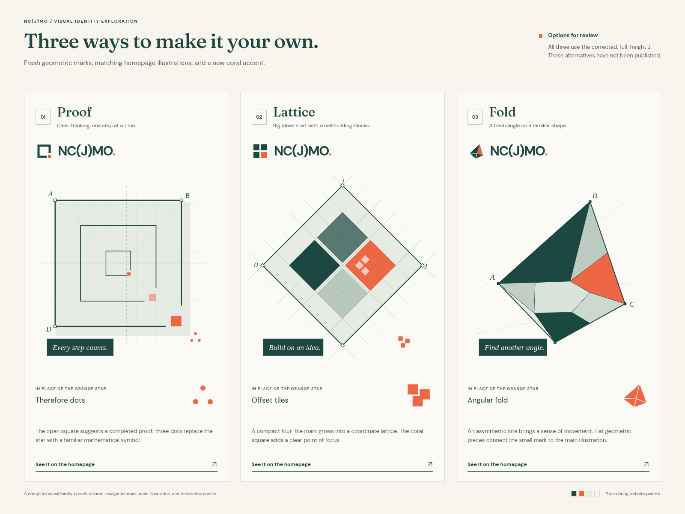
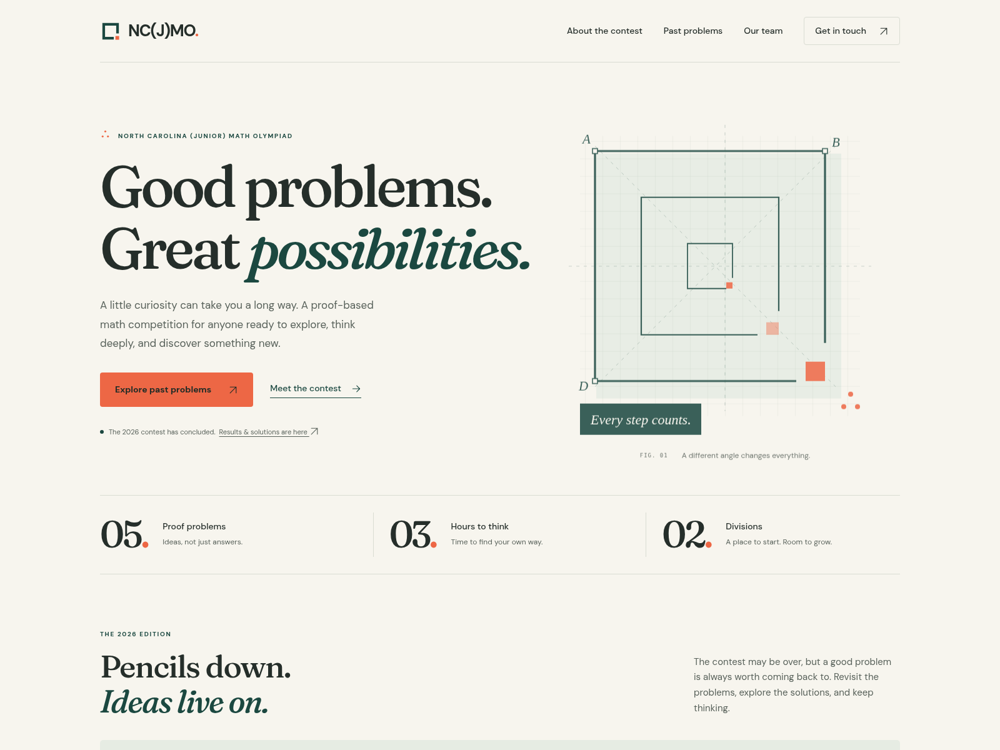
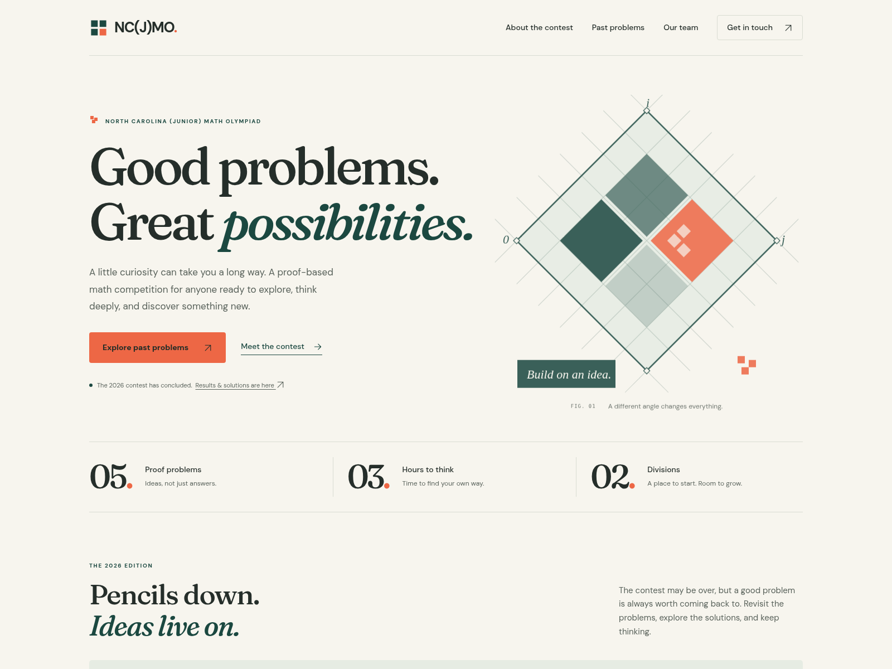
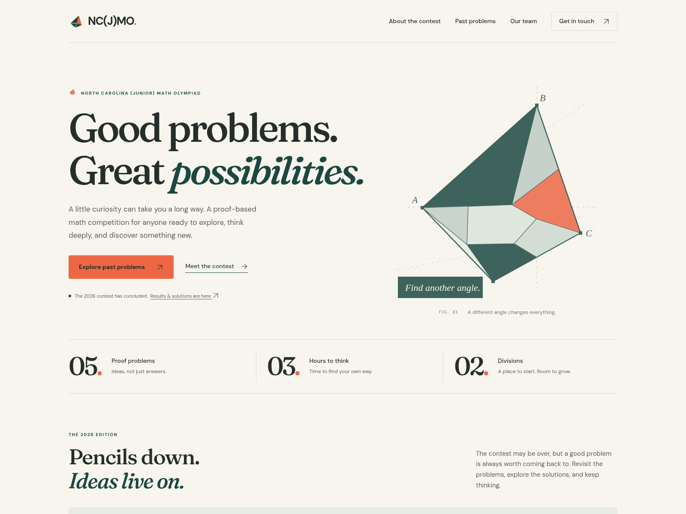

# NC(J)MO logo alternatives

Three alternatives for the header mark, homepage illustration, and orange accent. These are review options; none of these symbols has been applied to the official website. All previews show the corrected, full-size J in NC(J)MO.

Click any image to view it at full size on GitHub.

## Side-by-side comparison

## 1. Proof — recommended

An open-square mark, nested-square construction, and three mathematical “therefore” dots in place of the orange star.

## 2. Lattice

A modular square mark, coordinate lattice, and offset coral tiles.

## 3. Fold

An angular geometric mark, folded construction, and asymmetric coral kite.

The corresponding SVG source files are in `01-proof`, `02-lattice`, and `03-fold`. Each contains `mark.svg`, `hero.svg`, and `accent.svg`. A header mark and accent can also be selected from different options.
