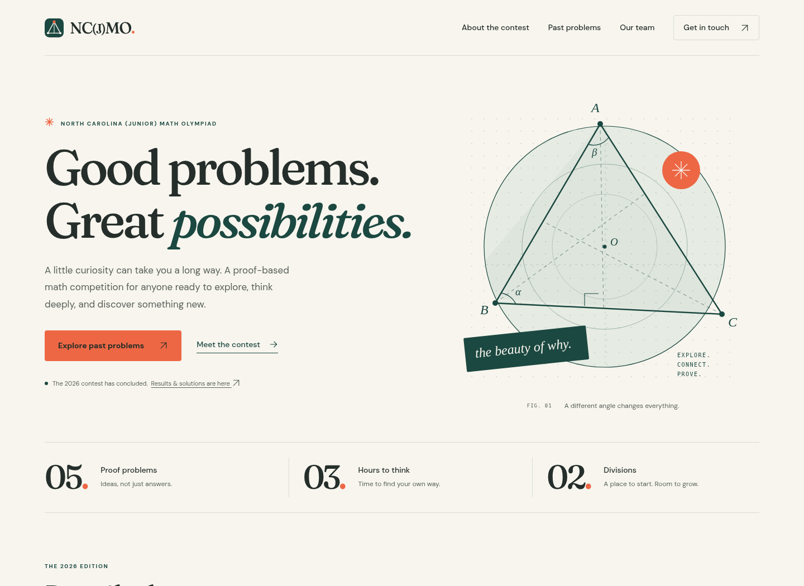
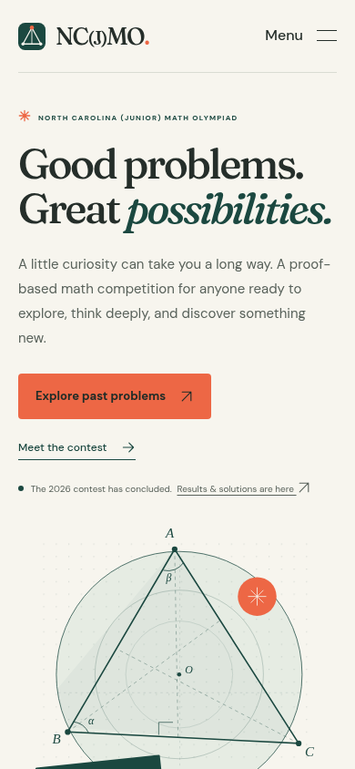
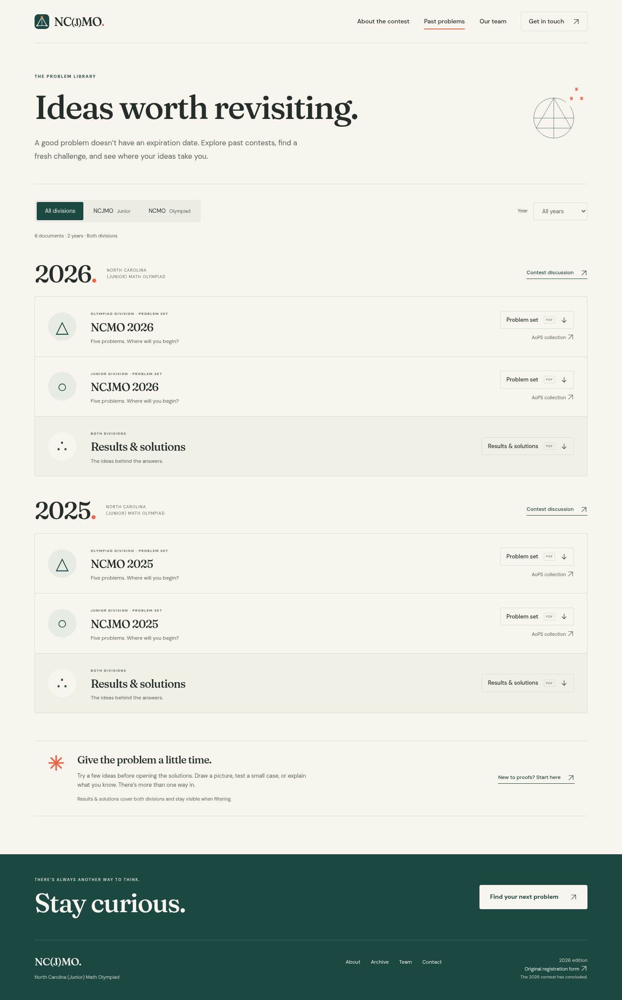

# Redesign review

These screenshots record the initial redesign review. The redesign was subsequently approved and published. The current site also includes the corrected wordmark, the selected Proof identity, and FAQs that start collapsed; the screenshots below remain a record of the original review.

See the [latest content and archive update](content-update/README.md) for current homepage and compact archive screenshots.

The visual direction uses warm paper, deep green, coral, Fraunces display typography, DM Sans text, and original geometric illustrations. Homepage links lead to the contest guide, team, and filterable problem archive. Each page uses the same navigation and footer.

## Screenshots

Screenshots were captured from the built static site in Chromium at 1440px desktop and 390px mobile widths.

[Complete desktop homepage](home-desktop.png) · [Complete mobile homepage](home-mobile.png) · [Mobile menu](mobile-menu.png)

[Mobile archive](archive-mobile.png) · [About page](about-desktop.png) · [Team page](team-desktop.png)

## What to review

- Overall visual identity, typography, and navigation labels.
- The homepage's ended-contest status and prominent archive links.
- Archive year/division filters, shared results, and problem downloads.
- Historical January 2026 dates and snowstorm updates.
- Older staff school years and the original 2026 registration form. Those details were retained rather than guessed.

## Validation

- Build passes and committed static pages match the source templates.
- Five Python tests pass, covering page URL aliases, generated output, custom 404, local links, and documents.
- Browser suite: 21 pass; one intentional skip because the desktop layout does not use the mobile menu.
- Zero automated axe WCAG A/AA violations on homepage, about, team, archive, and 404 at both tested viewports. Automated scans supplement the manual keyboard and visual checks.
- Tested keyboard skip link, mobile menu opening/Escape/contact focus, archive filtering/bookmarked URLs/back-forward behavior, reduced motion, and no-JavaScript navigation.
- All six PDFs and all 19 original external/contact destinations preserved. PDFs and Google verification are byte-unchanged. External destinations were preserved; third-party availability is outside this validation.
- Visually checked desktop/mobile screenshots; additional 320px, 375px, 768px, and 900px widths were inspected for overflow and broken images.

For a working local preview, follow [the setup and preview instructions](../../README.md). No public preview deployment has been created.
