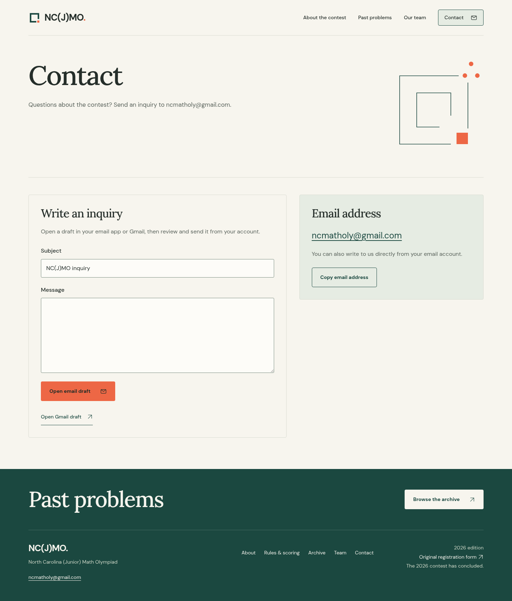
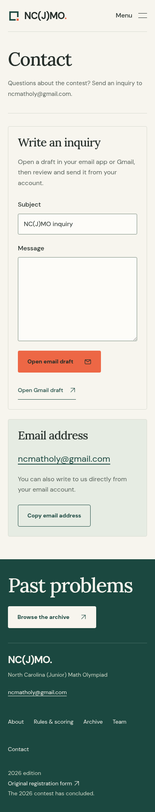
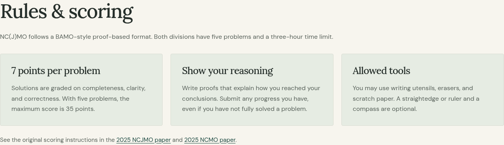
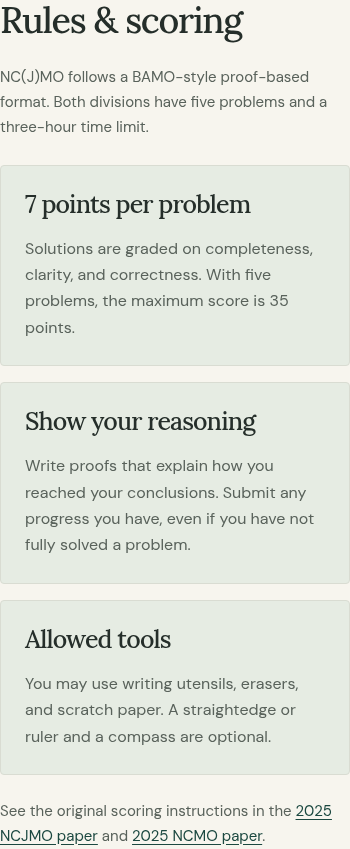

# Contact, rules, and scoring

Header and footer Contact links now open a real contact page. The header uses an envelope icon, and the footer displays ncmatholy@gmail.com. Visitors can write their inquiry, open a draft in their email app or Gmail, and review and send it from their own account. The original page keeps the message available. Copy-address feedback and manual copying work when clipboard access is unavailable.

The About page starts with Rules & scoring: five problems, three hours, seven points per problem, 35 maximum, proof-writing guidance, and permitted tools. Scoring comes from the unchanged published 2025 contest instructions. Difficulty guidance follows the organizers' description: NCJMO is similar to BAMO-8; NCMO is approximately USAJMO.

Validation: build and five Python tests passed. The browser suite passed 37 tests with one expected desktop-only mobile-menu skip. Visual checks covered five pages at 1440px, 1024px, 768px, 390px, and 320px. Tests cover draft URL encoding and retained messages, required input, Gmail tabs, clipboard success/fallback, no-JavaScript contact links, keyboard access, all PDF links, and archive filters. Draft destinations are checked without sending mail.

