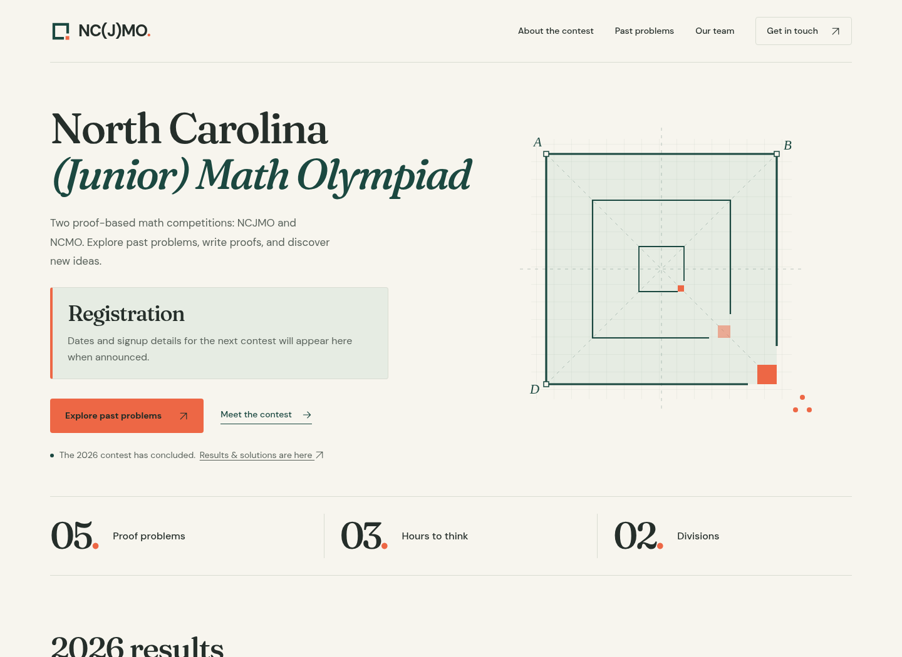
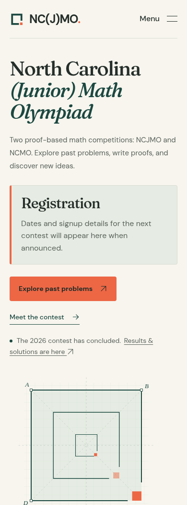
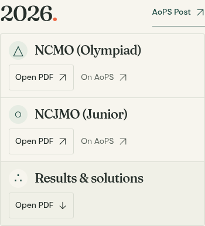

# Clearer contest pages and compact archive

The homepage leads with the contest name and a prominent registration placeholder. Dates and signup details are awaiting an organizer's announcement. Page and section headings state their purpose directly; decorative slogans and small repeated captions have been removed.

PDFs and external websites open in new tabs. Navigation between pages stays in the current tab. Archive rows are about 40% shorter and retain 44px link targets on phones.

Screenshots show the built site in Chromium at 1440px and 390px widths.

Validation: five Python tests passed; 23 browser tests passed with one expected desktop-only menu skip. Visual checks passed on all four main pages at 1440px, 768px, 390px, and 320px. PDF and AoPS popup checks passed at desktop and both phone widths; internal navigation remained in the same tab. All original PDF and external destinations are preserved.
