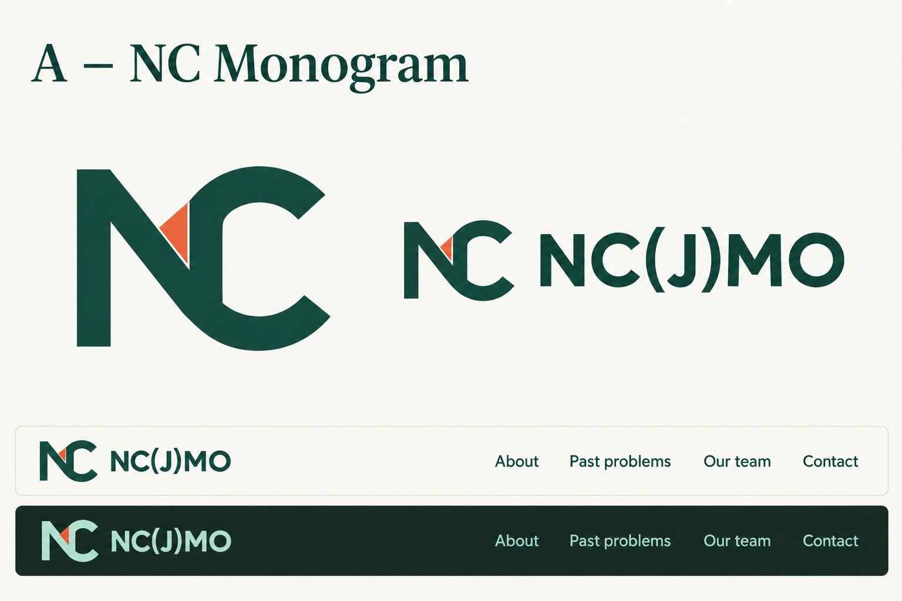
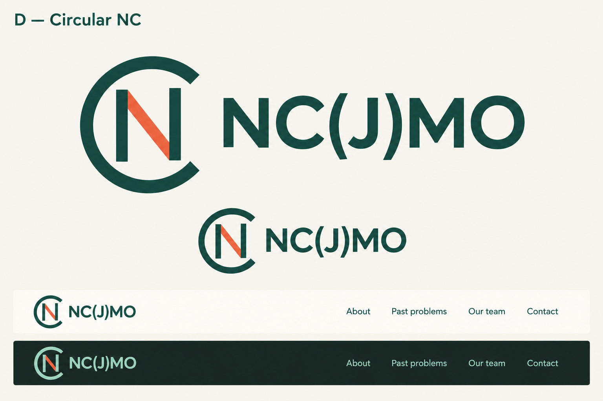
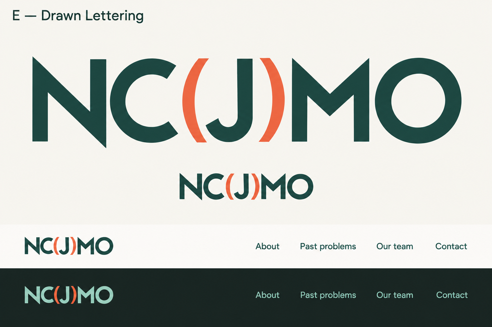
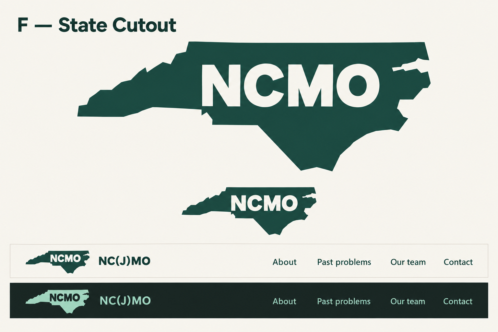

# NC(J)MO logo options

Four concepts for staff review. Each preview shows the logo at a large size and in light and dark website headers. Click an image to enlarge it. The live website has not been changed.

## A — NC Monogram

Interlocking N and C, with a coral triangle aligned to the surrounding strokes.

[Open A at full size](A-nc-monogram-aligned.png)

## D — Circular NC

An open circular C and a distinct N, with a coral diagonal.

[Open D at full size](D-circular-nc.png)

## E — Drawn Lettering

A custom geometric NC(J)MO wordmark, with coral parentheses.

[Open E at full size](E-drawn-lettering.png)

## F — State Cutout

NCMO set into a North Carolina silhouette.

[Open F at full size](F-state-cutout.png)
